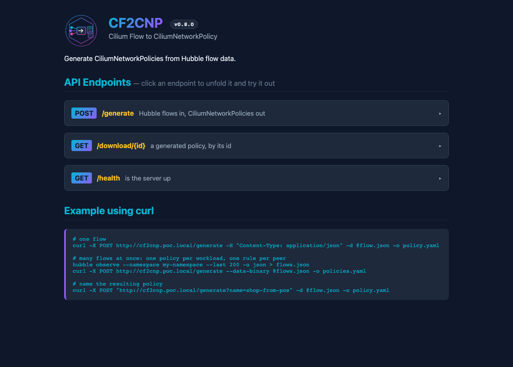
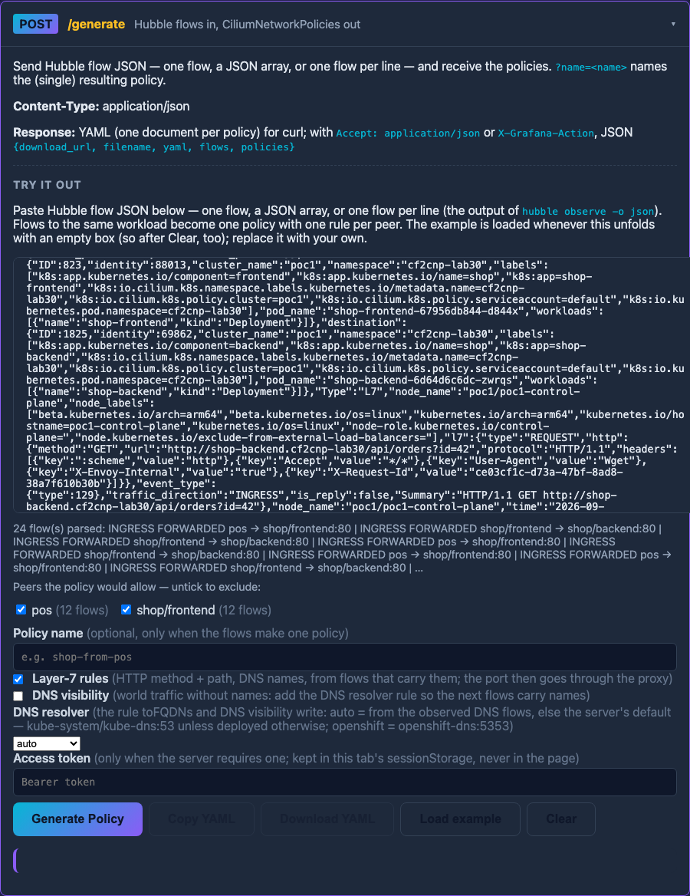
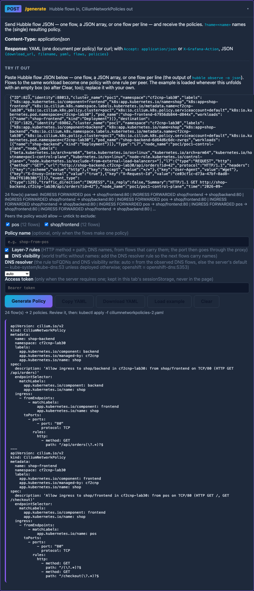
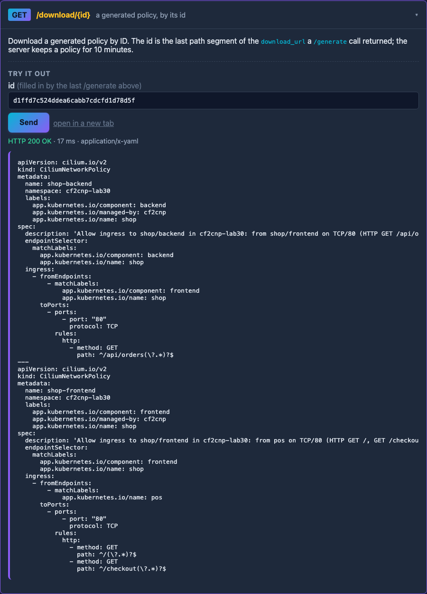
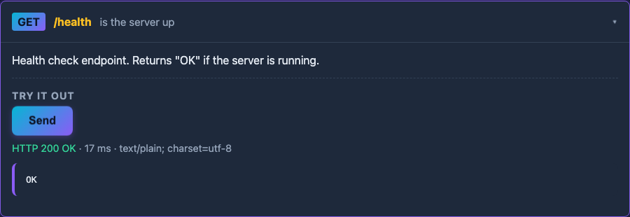
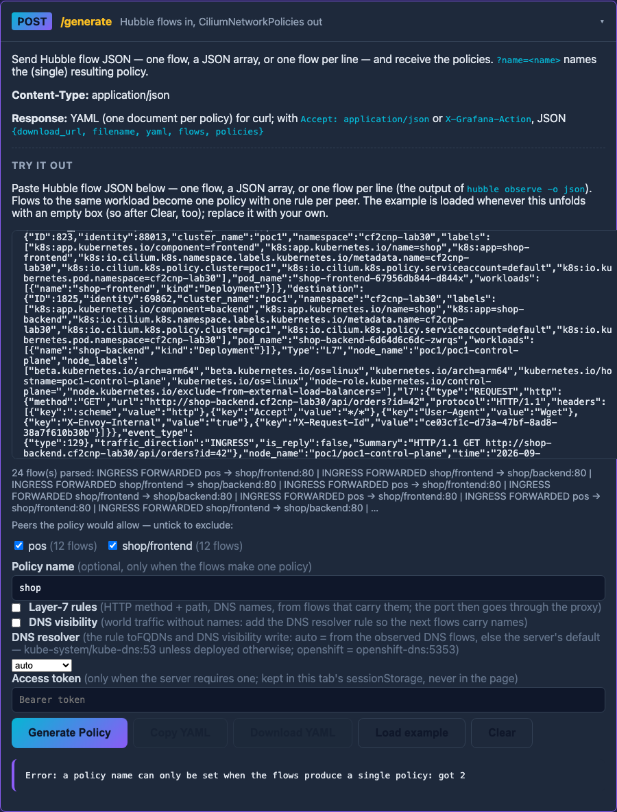

# CF2CNP - Cilium Flow to CiliumNetworkPolicy

A CLI tool that generates CiliumNetworkPolicies from Hubble flow data. This tool analyzes network traffic patterns captured by Hubble and automatically creates corresponding Cilium network policies.


**Running-test captures.** cf2cnp runs on every CI run of a reference Cilium 1.20.1 lab (a two-cluster ClusterMesh on kind) and the results are captured — see the [`ci-captures` branch](https://github.com/ephico2real2/cilium-implementation-poc/tree/ci-captures) (newest run first): `cf2cnp.png` (the tool output), `grafana-policy-verdicts-cf2cnp-lab.png` (the generated policy under audit / enforce), `hubble-ui-cf2cnp-lab.png`.

## Features

- **Automatic Policy Generation**: Reads Hubble flow JSON files and generates CiliumNetworkPolicy YAML files
- **Smart Label Filtering**: Extracts only relevant app labels (see [label Selection](#label-selection))
- **Cross-Namespace Support**: Automatically adds namespace labels for cross-namespace traffic
- **FQDN Egress Support**: Generates proper `toFQDNs` rules with required DNS resolution rules for external traffic
- **Flow Aggregation**: Combines multiple flows with the same source/destination into a single policy with multiple ports, and flows that select the same workload into one policy with one rule per peer (so two peers of one service are one object, not two objects with the same name)
- **Many Flows at Once**: A file, a request body or a pasted text may hold one flow, a JSON array of flows, or one flow per line — the output of `hubble observe -o json`
- **HTTP Server Mode**: Run as a containerized service to generate policies via HTTP API

> **Caution:** This project was created with the help of AI. While I have extensive experience with Kubernetes and Cilium, I do not have the Go programming expertise to write this tool from scratch. AI assistance made it possible to bring this idea to life and share it with the community. Please be careful when using this tool in production environments. Always review generated policies before applying them to your cluster.

## The spec this build supports

cf2cnp's policy types are Cilium's own (`github.com/cilium/cilium/pkg/policy/api`, pinned in `go.mod`), so every
field of the CiliumNetworkPolicy spec exists, Cilium's `Sanitize()` — the checks the agent applies at admission —
runs on every generated or merged policy (on a copy; the agent's own message comes back as a 400 or an exit 1), and
the CRD of the same Cilium version is embedded from the module (`internal/crd`, copied by `go generate`, checked in
CI). `cf2cnp version` prints both:

```text
cf2cnp 0.8.0
policy spec: CiliumNetworkPolicy cilium.io/v2 as of Cilium v1.20.1 (types: github.com/cilium/cilium/pkg/policy/api v1.20.1; CRD embedded from the same module)
```

| cf2cnp | Cilium policy spec | Notes |
|---|---|---|
| 0.7.0 – 0.8.0 | v1.20.1 | Cilium's types; `fromCIDR` for external sources; the DNS resolver from the flows (Kubernetes / OpenShift); `validate`, `version`; 0.8.0: the API page as a Swagger-like surface (see [The web UI](#the-web-ui)) |
| 0.5.0 – 0.6.3 | hand-written subset | 20 of the spec's 291 fields (`docs/CRD-SPEC-FORENSICS.md`) |

A Cilium bump is a release: Renovate proposes it (`renovate.json`), the embedded CRD follows, and the golden tests
(`internal/testdata/golden`, 14 real captures whose answers must stay byte for byte) say what changed. Output is
rendered in a fixed, readable field order (`internal/render`), not the alphabetical order Kubernetes' YAML library
would give.

`cf2cnp validate <file>…` runs the same checks on any policy file, generated or hand-written:

```bash
cf2cnp validate policies/*.yaml       # exit code = documents refused; each refusal carries Cilium's own sentence
```

## Binaries

Every `v*` tag publishes `cf2cnp_<version>_<os>_<arch>.tar.gz` (linux and darwin, amd64 and arm64) with a
checksums file on the tag's GitHub release, for pipelines that run `cf2cnp merge` without a Go toolchain:

```bash
curl -sSL -o cf2cnp.tgz https://github.com/ephico2real2/cf2cnp/releases/download/v0.8.0/cf2cnp_0.8.0_linux_amd64.tar.gz
tar -xzf cf2cnp.tgz && sudo install cf2cnp /usr/local/bin/cf2cnp
```

## Building

Clone the repository and build the binary:

```bash
# Clone the repository
git clone https://github.com/ephico2real2/cf2cnp.git
cd cf2cnp

# Build the binary
go build -o cf2cnp ./cmd/cf2cnp

# Or on Windows
go build -o cf2cnp.exe ./cmd/cf2cnp
```

## Installation

> **Fork note (ephico2real2/cf2cnp):** while the changes on this fork are pending upstream, the fork's chart is published as a
> classic Helm repository at `https://ephico2real2.github.io/cf2cnp` (chart 0.8.0, appVersion 0.8.0) and its image as
> `ghcr.io/ephico2real2/cf2cnp:0.8.0`. `helm repo add cf2cnp-fork https://ephico2real2.github.io/cf2cnp`.
> The same chart is on GHCR as OCI: `oci://ghcr.io/ephico2real2/helm-charts/cf2cnp` (version 0.8.0).

The easiest way to use `CF2CNP` is to deploy it together with the [hubble-observer Helm chart](https://github.com/onzack/hubble-observer). This chart installs both the Hubble observer (to collect network flow data) and `CF2CNP` into your Kubernetes cluster, so you can generate policies directly from observed traffic. You can find installation instructions and configuration options for the Helm chart in the [hubble-observer Helm chart repository](https://github.com/onzack/hubble-observer).

## Usage

The tool supports two modes of operation:

### 1. File-based Generation (CLI Mode)

Generate policies from flow files in a directory:

```bash
cf2cnp generate --input <input-directory> --output <output-directory>
```

#### Flags

| Flag        | Short | Description                                            | Required |
|-------------|-------|--------------------------------------------------------|----------|
| `--input`   | `-i`  | Directory containing Hubble flow JSON files            | Yes      |
| `--output`  | `-o`  | Directory for generated CiliumNetworkPolicy YAML files | Yes      |

#### Example

```bash
# Generate policies from an folder with Cilium flows in it.
cf2cnp generate --input ./inputfolder --output ./generated-policies
```

Every policy's `description` is written from its rules (0.6.2, 0.6.3): the subject, each peer the way the selector names it (with its namespace or cluster when they differ), the ports, and the L7 rules — `Allow ingress to shop/frontend in cf2cnp-lab27: from pos on TCP/80 (HTTP GET /, GET /checkout); from kiosk on TCP/80`.

### 1b. Merge into an existing policy (CLI)

Evolve a policy that is already applied instead of regenerating it — every field of the existing document
survives (`ingressDeny`, annotations, …), only rules that are not there yet are added, and running it
twice changes nothing:

```bash
cf2cnp merge --existing policies/shop.yaml --input flows.json          # in place
cf2cnp merge --existing policies/shop.yaml --input flows/ -o new.yaml  # to another file
```

The merged file is the existing file plus the new rules — key order, comments, quoting and indentation are kept, so a pull
request shows the rules that were added and nothing else (0.6.1; 0.6.0 re-serialised the whole document).

The flows must produce exactly one policy, for the same target (namespace, name, endpointSelector) as the
existing file; otherwise the command refuses.

### The DNS resolver rule (toFQDNs, --dns-visibility)

A `toFQDNs` rule needs the pod's lookups to pass through Cilium's DNS proxy, which the egress rule to the cluster's DNS
with `rules.dns` turns on. Where that DNS is differs by platform, and Cilium's DNS guide says so for OpenShift
("match the namespace openshift-dns instead of kube-system, remove the match on k8s-app=kube-dns, and change the port to
5353"). cf2cnp derives the rule from the observed DNS flows when the input has them — the pods the workload asked
(CoreDNS by its `k8s-app: kube-dns` label, or `app.kubernetes.io/name: coredns` as the CoreDNS Helm chart labels it,
NodeLocal DNSCache when a Local Redirect Policy sends the lookups there, OpenShift's DNS operator by its namespace), on the port it used — and takes a profile otherwise. The rule's protocol is `ANY`
either way, as Cilium's own examples write it: a lookup whose UDP answer is truncated retries over TCP, and a
UDP-only rule denies that retry under default-deny egress.

```bash
cf2cnp generate -i flows.ndjson -o out --dns-profile auto        # default: from the flows, else kubernetes
cf2cnp generate -i flows.ndjson -o out --dns-profile kubernetes  # kube-system, k8s-app=kube-dns, 53/ANY
cf2cnp generate -i flows.ndjson -o out --dns-profile openshift   # openshift-dns, 5353/ANY (no k8s-app label)
cf2cnp generate -i flows.ndjson -o out --dns-resolver dns-system/app=coredns:5353/ANY   # any resolver
```

The API takes `?dnsProfile=` and `?dnsResolver=`; the page has a selector. `merge` takes the same flags. A deployed
server takes them too (`serve --dns-profile` / `--dns-resolver`, env `CF2CNP_DNS_PROFILE` / `CF2CNP_DNS_RESOLVER`;
chart values `dns.profile` / `dns.resolver`): the default a request gets when it names none — an OpenShift cluster
sets `dns.profile: openshift` once, and the Grafana action needs no parameter.

### External sources: fromCIDR

An ingress flow whose source is outside the cluster (`reserved:world` — `reserved:world-ipv4` / `reserved:world-ipv6`
on a dual-stack cluster — with an address: an egress-gateway IP, a load balancer's client, an office range) becomes
`fromCIDR: [<address>/32]` (`/128` for IPv6), what the receiver actually saw; without an
address it stays `fromEntities: [world]`. Cilium refuses a rule that mixes `fromEndpoints` and `fromCIDR`, so cf2cnp
keeps them in separate rules (and `Sanitize` would say so).

### 2. HTTP Server Mode

Start an HTTP server to generate policies via API:

```bash
cf2cnp serve --port 8080
```

#### Server Flags

| Flag             | Short | Type   | Description                                                                                                                                                           | Default |
|------------------|-------|--------|-----------------------------------------------------------------------------------------------------------------------------------------------------------------------|---------|
| `--port`         | `-p`  | int    | Port number to listen on                                                                                                                                              | `8080`  |
| `--external-url` |       | string | Base URL clients reach the server at, used for `download_url` (env `CF2CNP_EXTERNAL_URL`). Empty: derived from the request and its `Forwarded` / `X-Forwarded-Proto` / `X-Forwarded-Host` headers | `""`    |
| `--dns-profile`  |       | string | The DNS resolver profile a request gets when it omits `?dnsProfile=`: `auto`, `kubernetes`, `openshift` (env `CF2CNP_DNS_PROFILE`; a bad value stops the server at start) | `auto`  |
| `--dns-resolver` |       | string | The DNS resolver a request gets when it omits `?dnsResolver=`, `<namespace>[/<label>=<value>]:<port>[/<protocol>]` (env `CF2CNP_DNS_RESOLVER`) | `""`    |
| `--allowed-origins` |       | string | Comma-separated origins allowed by CORS (e.g. `https://grafana.example.com`); empty or `*` = any origin (env `CF2CNP_ALLOWED_ORIGINS`) | `""`    |
| `--auth-token`      |       | string | When set, `/generate` and `/download` require `Authorization: Bearer <token>` (env `CF2CNP_AUTH_TOKEN`; prefer the env) | `""`    |

---

#### API Endpoints

| Method | Endpoint       | Description                                              | Request Body                  | Response            |
|--------|---------------|-----------------------------------------------------------|-------------------------------|---------------------|
| `POST` | `/generate`   | Generate policies from Hubble flow JSON: one flow, a JSON array, or one flow per line. `?name=<name>` names the (single) resulting policy; `?l7=true` emits layer-7 rules; `?dnsVisibility=true` adds the DNS resolver rule for world traffic without names; `?dnsProfile=` / `?dnsResolver=` pick the resolver; `?exclude=key=value` (repeatable) drops flows whose peer carries that label | Hubble flow JSON | CiliumNetworkPolicy YAML (one document per policy), or JSON when the request carries `Accept: application/json` or `X-Grafana-Action` |
| `GET`  | `/download/{id}` | Download a policy generated by a JSON-mode request (cached for 10 minutes; `{id}` is the flow's UUID for a single flow) | _none_ | CiliumNetworkPolicy YAML as an attachment |
| `GET`  | `/health`     | Health check for the service                              | _none_                        | Status message      |
| `GET`  | `/`           | The API page: each endpoint documented, with a Try-it-out panel under it ([The web UI](#the-web-ui)) | _none_                        | Web UI page         |

The JSON answer is `{"download_url", "filename", "message", "flows", "policies", "yaml"}` — the YAML is in it, so a client
need not follow the URL. `download_url` is built from `--external-url` when set, else from the request and the proxy
headers a TLS-terminating ingress or gateway sets (`Forwarded: proto=…;host=…`, `X-Forwarded-Proto`, `X-Forwarded-Host`).

#### Example: Using curl

```bash
# Generate a policy from a flow file
curl -X POST http://localhost:8080/generate \
  -H "Content-Type: application/json" \
  -d @flow.json \
  -o policy.yaml

# Many flows at once (the output of `hubble observe -o json`): one policy per workload, one rule per peer
hubble observe --namespace shop --last 200 -o json > flows.json
curl -X POST http://localhost:8080/generate --data-binary @flows.json -o policies.yaml

# Name the resulting policy yourself
curl -X POST "http://localhost:8080/generate?name=shop-from-pos" -d @flow.json -o policy.yaml
```

### The web UI

Open the server's root (`http://localhost:8080`, or wherever the chart's route points — the lab below is
`cf2cnp.poc.local`) and the page documents the three endpoints the way Swagger UI would: the build's version
beside the logo, each endpoint a card that unfolds into its description and a Try-it-out panel. Screenshots
from the 0.8.0 release on a Cilium 1.20.1 kind cluster, with the 24 HTTP flows demo 30 of the lab recorded
(`hubble observe -o json`):



The page as it opens: `v0.8.0` beside the logo, `POST /generate`, `GET /download/{id}`, `GET /health`, and the curl
example written on the page's own base URL.



**Paste flows.** One flow, a JSON array or one flow per line. The page parses as you type — `24 flow(s) parsed`,
each summarised as `direction verdict source → destination:port` — and lists the peers the policy would allow
(`pos`, `shop/frontend`, 12 flows each); untick one to exclude it. Layer-7 rules ticked, so HTTP method + path from
the flows' `l7` records become `rules.http`.



**Generate Policy.** `24 flow(s) → 2 policies` — one per workload, one rule per peer: `shop-backend` allows
`shop/frontend` on TCP/80 `GET /api/orders`, `shop-frontend` allows `pos` on `GET /` and `GET /checkout`; every
policy carries `app.kubernetes.io/managed-by: cf2cnp` and a description written from its rules. Copy YAML and
Download YAML are live; the page names the file to `kubectl apply`.



**/download/{id}.** The id is filled in from the last generate's `download_url`; Send fetches the same YAML
(`HTTP 200 OK · 17 ms · application/x-yaml`), and "open in a new tab" is the plain link. The server keeps a
policy for 10 minutes.



**/health.** `HTTP 200 · text/plain` and `OK` — the probe the chart's liveness and readiness use.



**A refusal is a sentence, not a stack trace.** A name was typed while the flows make two policies:
`Error: a policy name can only be set when the flows produce a single policy: got 2` (HTTP 400). Cilium's own
`Sanitize()` refusals arrive the same way.

An access token typed in the form goes only into this tab's `sessionStorage` and the request's `Authorization`
header (for a server started with `--auth-token`); with a token in the field, the download's new-tab link is
hidden, since a navigation cannot carry the header.

## Docker Deployment

### Build the Docker image

```bash
docker build -t cf2cnp .
```

### Run the container

```bash
docker run -p 8080:8080 cf2cnp serve
```

The server will be available at `http://localhost:8080`.

## Input Format

The tool expects Hubble flow data in JSON format. Each file should contain a single flow object with the following structure:

```json
{
  "flow": {
    "traffic_direction": "INGRESS",
    "source": {
      "namespace": "source-namespace",
      "labels": ["k8s:app.kubernetes.io/name=source-service", "k8s:app.kubernetes.io/component=source-component"]
    },
    "destination": {
      "namespace": "destination-namespace",
      "labels": ["k8s:app.kubernetes.io/name=destination-service", "k8s:app.kubernetes.io/component=destination-component"]
    },
    "destination_names": ["onzack.com"],
    "l4": {
      "TCP": {
        "destination_port": 80
      }
    }
  }
}
```

### Collecting Flows from Hubble

You can export flows from Hubble using the Hubble CLI:

```bash
# Observe flows and save to JSON
hubble observe --output json > flows.json

# Or filter for specific traffic
hubble observe --namespace my-namespace --output json > my-flows.json
```

## Output Format

The generated CiliumNetworkPolicy files follow the [Cilium Network Policy specification](https://docs.cilium.io/en/stable/security/policy/language/).

### Ingress Policy Example

```yaml
apiVersion: cilium.io/v2
kind: CiliumNetworkPolicy
metadata:
  name: destination-service-destination-component
  namespace: destination-namespace
  labels:
    app.kubernetes.io/component: destination-component
    app.kubernetes.io/managed-by: cf2cnp
    app.kubernetes.io/name: destination-service
spec:
  description: 'Allow ingress to destination-service/destination-component in destination-namespace: from source-service/source-component in source-namespace on TCP/80'
  endpointSelector:
    matchLabels:
      app.kubernetes.io/component: destination-component
      app.kubernetes.io/name: destination-service
  ingress:
    - fromEndpoints:
        - matchLabels:
            app.kubernetes.io/component: source-component
            app.kubernetes.io/name: source-service
            io.kubernetes.pod.namespace: source-namespace
      toPorts:
        - ports:
            - port: "80"
              protocol: TCP
```

### Egress Policy with FQDN Example

For external traffic (to "world"), the tool automatically includes DNS resolution rules:

```yaml
apiVersion: cilium.io/v2
kind: CiliumNetworkPolicy
metadata:
  name: source-service
  namespace: source-namespace
  labels:
    app.kubernetes.io/managed-by: cf2cnp
    app.kubernetes.io/name: source-service
spec:
  description: 'Allow egress from source-service in source-namespace: to onzack.com on TCP/443; to kube-dns in kube-system on ANY/53 (DNS *)'
  endpointSelector:
    matchLabels:
      app.kubernetes.io/name: source-service
  egress:
    - toFQDNs:
        - matchName: onzack.com
      toPorts:
        - ports:
            - port: "443"
              protocol: TCP
    - toEndpoints:
        - matchLabels:
            io.kubernetes.pod.namespace: kube-system
            k8s-app: kube-dns
      toPorts:
        - ports:
            - port: "53"
              protocol: ANY
          rules:
            dns:
              - matchPattern: '*'
```

The DNS rule's protocol is `ANY`, as Cilium's examples write it: a truncated UDP answer is retried over TCP, and a
UDP-only rule would deny that retry under default-deny egress.

## Easter Egg: YOLO Mode

For those times when you just need to get things working in development, CF2CNP includes a YOLO mode that generates a policy allowing all traffic within a namespace.

### CLI Usage

```bash
# Generate a YOLO policy for the default namespace
cf2cnp yolo ns

# Generate a YOLO policy for a specific namespace
cf2cnp yolo ns --namespace my-dev-namespace
```

### API Usage

Send a POST request with the body `yolo ns <namespace>`:

```bash
# YOLO policy for the default namespace
curl -X POST http://localhost:8080/generate \
  -d "yolo ns" \
  -o yolo-policy.yaml

# YOLO policy for a specific namespace
curl -X POST http://localhost:8080/generate \
  -d "yolo ns my-dev-namespace" \
  -o yolo-policy.yaml
```

### Generated Policy

The YOLO policy allows all ingress and egress traffic within the specified namespace:

```yaml
apiVersion: cilium.io/v2
kind: CiliumNetworkPolicy
metadata:
  name: yolo-allow-all-in-namespace
  namespace: my-dev-namespace
spec:
  description: YOLO! Allow all traffic within the my-dev-namespace namespace.
  endpointSelector:
    matchLabels: {}
  ingress:
    - fromEndpoints:
        - matchLabels: {}
  egress:
    - toEndpoints:
        - matchLabels: {}
```

## Label Selection

The tool filters labels to keep policies clean and maintainable:

1. **Priority Labels** (used if present):
   - `app.kubernetes.io/name`
   - `app.kubernetes.io/component`
   - `app.kubernetes.io/instance`

2. **Fallback Label** (used if no priority labels exist):
   - `app`
   - `k8s-app`
   - `name`
   - `component`
   - `instance`

## License

Apache License 2.0 - see [LICENSE](LICENSE) for details.
